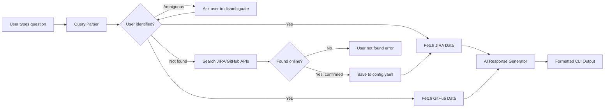
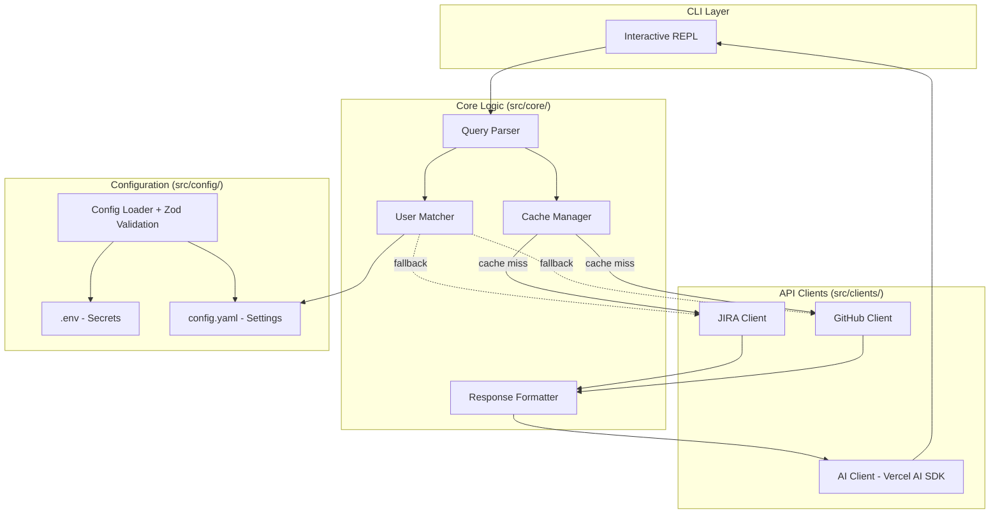
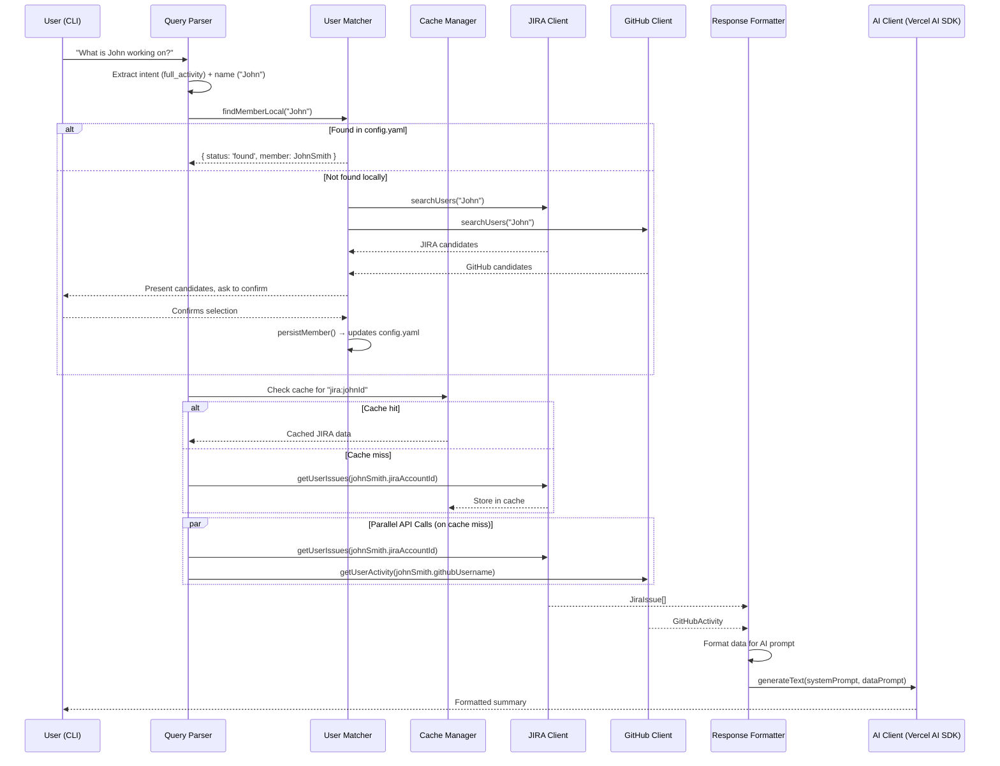
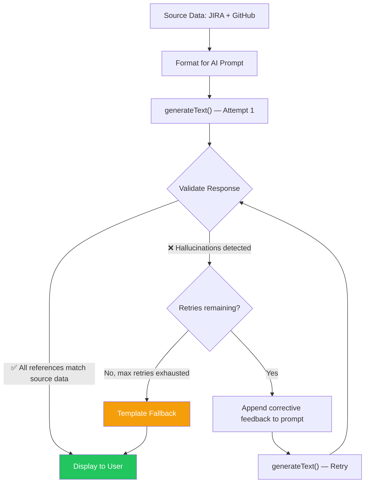

# Technical Specification: Team Activity Monitor

> **Version**: 1.3 (Final Implementation)
> **Date**: 2026-03-05
> **Status**: Finalized — Matches Implementation

---

## Table of Contents

1. [System Overview](#1-system-overview)
2. [Architecture](#2-architecture)
3. [Configuration](#3-configuration)
4. [Module Specifications](#4-module-specifications)
5. [Data Models](#5-data-models)
6. [Query Processing Pipeline](#6-query-processing-pipeline)
7. [Error Handling](#7-error-handling)
8. [Project Structure](#8-project-structure)
9. [Dependencies](#9-dependencies)
10. [Testing Strategy](#10-testing-strategy)
11. [AI Hallucination Prevention & Retry Strategy](#11-ai-hallucination-prevention--retry-strategy)

---

## 1. System Overview

### 1.1 Purpose

A CLI-based chatbot that answers questions like _"What is [member] working on?"_ by fetching and combining data from JIRA and GitHub, then generating a human-readable summary using a configurable AI provider (via Vercel AI SDK).

### 1.2 High-Level Flow



### 1.3 Key Assumptions

| #   | Assumption                                                                                                   |
| --- | ------------------------------------------------------------------------------------------------------------ |
| A1  | Team members can be pre-registered in `config.yaml` **or** discovered dynamically via JIRA/GitHub API search |
| A2  | JIRA instance is Atlassian Cloud (REST API v3)                                                               |
| A3  | GitHub repos are accessible with a single PAT (Personal Access Token)                                        |
| A4  | "Recent" is configurable — defaults to 7 days, but can be changed via `config.yaml`                          |
| A5  | JIRA results focus on active work — excludes issues in the "Done" status category                            |
| A6  | The AI provider defaults to Gemini (free tier) but is switchable via config using Vercel AI SDK              |

---

## 2. Architecture

### 2.1 Architecture Style

Modular monolith — single Node.js process with cleanly grouped modules by responsibility. No microservices, no HTTP server.

### 2.2 Component Diagram



### 2.3 Runtime

- **Runtime**: Node.js 20+ (LTS)
- **Language**: TypeScript 5.x (strict mode)
- **Dev runner**: `tsx` (modern TypeScript execution with robust ESM support)
- **Build**: `tsc` → `dist/` (for final deliverable)

---

## 3. Configuration

### 3.1 `.env` — Secrets (gitignored)

```bash
# JIRA
JIRA_BASE_URL=https://your-domain.atlassian.net
JIRA_EMAIL=you@example.com
JIRA_API_TOKEN=your-jira-api-token

# GitHub
GITHUB_TOKEN=ghp_xxxxxxxxxxxxxxxxxxxx

# AI Provider
AI_API_KEY=your-ai-api-key
```

### 3.2 `config.yaml` — Structured Settings

```yaml
# AI Configuration
ai:
  provider: "gemini" # Options: gemini | openai | claude
  model: "gemini-2.0-flash" # Model name for the chosen provider
  temperature: 0.3 # Lower = more factual

# JIRA Configuration
jira:
  project_keys: # JIRA project keys to search within
    - "PROJ"
    - "TEAM"
  board_id: 42 # Board ID for sprint data (optional)
  lookback_days: 7 # Days to look back for activity

# GitHub Configuration
github:
  repos: # Repositories to monitor
    - "org/repo-1"
    - "org/repo-2"
  lookback_days: 7 # Days to look back for commits/PRs

# Cache Configuration
cache:
  enabled: true
  ttl_minutes: 5 # Time-to-live for cached API responses

# Team Members (auto-populated when users are discovered via API)
team:
  - name: "John Smith"
    jira_account_id: "5a1234567890abcdef123456"
    github_username: "jsmith"
  - name: "Sarah Connor"
    jira_account_id: "5b9876543210fedcba654321"
    github_username: "sconnor"
```

### 3.3 Config Loading

- **Module**: `src/config/loader.ts`
- **Validation**: All config values validated with Zod schemas at startup
- **Behavior**: Application exits with a clear error message if required config is missing
- **Config writing**: When a new user is discovered via API, `config.yaml` is updated and saved back

```typescript
// Pseudocode
interface AppConfig {
  ai: {
    provider: "gemini" | "openai" | "claude";
    model: string;
    temperature: number;
  };
  jira: {
    baseUrl: string;
    email: string;
    apiToken: string;
    projectKeys: string[];
    boardId?: number;
    lookbackDays: number;
  };
  github: {
    token: string;
    repos: string[];
    lookbackDays: number;
  };
  cache: {
    enabled: boolean;
    ttlMinutes: number;
  };
  team: TeamMember[];
}

interface TeamMember {
  name: string;
  jiraAccountId: string;
  githubUsername: string;
}
```

---

## 4. Module Specifications

### 4.1 JIRA Client (`src/clients/jira-client.ts`)

**Responsibility**: All communication with the JIRA REST API.

**Authentication**: Basic Auth — `email:apiToken` encoded as Base64 in the `Authorization` header.

**API Endpoints Used**:

| Method | Endpoint                               | Purpose                                    |
| ------ | -------------------------------------- | ------------------------------------------ |
| `GET`  | `/rest/api/3/search/jql`               | Search issues using JQL                    |
| `GET`  | `/rest/api/3/issue/{issueKey}`         | Get issue details (if needed)              |
| `GET`  | `/rest/api/3/user/search?query={name}` | Search for users by name (hybrid registry) |

**Key Functions**:

```typescript
// Fetch all issues assigned to a user within the configured time range
async function getUserIssues(accountId: string): Promise<JiraIssue[]>;

// Fetch sprint data for the configured board
async function getRecentSprints(
  boardId: number,
  count: number,
): Promise<Sprint[]>;

// Search for a user by name (used by hybrid user registry)
async function searchUsers(query: string): Promise<JiraUserSearchResult[]>;

// Build JQL query for the user
function buildJqlQuery(
  accountId: string,
  projectKeys: string[],
  dateRange: DateRange,
): string;
```

**JQL Strategy**:

```
assignee = "{accountId}"
AND project IN ({projectKeys})
AND statusCategory != Done
AND updated >= "{startDate}"
ORDER BY updated DESC
```

> [!IMPORTANT]
> The `updated` field is used instead of `created` to catch issues that were worked on during the period, even if they were created earlier.

**Response Data to Extract**:

| Field           | Source                                              |
| --------------- | --------------------------------------------------- |
| Issue key       | `key`                                               |
| Summary         | `fields.summary`                                    |
| Status          | `fields.status.name`                                |
| Status Category | `fields.status.statusCategory.name`                 |
| Priority        | `fields.priority.name`                              |
| Issue Type      | `fields.issuetype.name`                             |
| Updated         | `fields.updated`                                    |
| Sprint          | `fields.sprint.name` (if available)                 |
| Story Points    | `fields.story_points` or `fields.customfield_XXXXX` |

---

### 4.2 GitHub Client (`src/clients/github-client.ts`)

**Responsibility**: All communication with the GitHub REST API.

**Authentication**: `Authorization: Bearer {token}` header.

**API Endpoints Used**:

| Method | Endpoint                                            | Purpose                                    |
| ------ | --------------------------------------------------- | ------------------------------------------ |
| `GET`  | `/repos/{owner}/{repo}/commits`                     | Get commits by author                      |
| `GET`  | `/repos/{owner}/{repo}/pulls`                       | Get pull requests by author                |
| `GET`  | `/repos/{owner}/{repo}/pulls/{pull_number}/reviews` | Get review data for a PR                   |
| `GET`  | `/search/issues`                                    | Search for PRs by author across repos      |
| `GET`  | `/search/users?q={name}`                            | Search for users by name (hybrid registry) |

**Key Functions**:

```typescript
// Fetch recent commits across all configured repos for a user
async function getUserCommits(
  username: string,
  since: Date,
): Promise<GitHubCommit[]>;

// Fetch recent PRs (open + recently merged) for a user
async function getUserPullRequests(
  username: string,
  since: Date,
): Promise<GitHubPR[]>;

// Aggregate activity summary
async function getUserActivity(
  username: string,
  since: Date,
): Promise<GitHubActivity>;

// Search for a user by name (used by hybrid user registry)
async function searchUsers(query: string): Promise<GitHubUserSearchResult[]>;
```

**Concurrency**: Use `Promise.allSettled` to fetch from multiple repos in parallel. If one repo fails (permissions, deleted), others still return data.

**Response Data to Extract**:

| Field               | Source                    |
| ------------------- | ------------------------- |
| Commit SHA (short)  | `sha.substring(0, 7)`     |
| Commit message      | `commit.message`          |
| Commit date         | `commit.author.date`      |
| Repository          | parsed from URL           |
| PR title            | `title`                   |
| PR state            | `state` + `merged_at`     |
| PR URL              | `html_url`                |
| Files changed       | `changed_files`           |
| Additions/Deletions | `additions` / `deletions` |

---

### 4.3 AI Client (`src/clients/ai-client.ts`)

**Responsibility**: Unified interface for generating AI responses using the **Vercel AI SDK**.

**Design Pattern**: The Vercel AI SDK provides a built-in unified API via `generateText()`. We use provider-specific packages (`@ai-sdk/google`, `@ai-sdk/openai`, `@ai-sdk/anthropic`) and a factory function to select the provider from config.

**Supported Providers**:

| Provider   | SDK Package         | Free Tier            |
| ---------- | ------------------- | -------------------- |
| **Gemini** | `@ai-sdk/google`    | ✅ (generous)        |
| **OpenAI** | `@ai-sdk/openai`    | ❌ (paid, but cheap) |
| **Claude** | `@ai-sdk/anthropic` | ❌ (paid)            |

**Interface**:

```typescript
import { generateText } from "ai";
import { google } from "@ai-sdk/google";
import { openai } from "@ai-sdk/openai";
import { anthropic } from "@ai-sdk/anthropic";

// Factory to get the right model based on config
function getModel(provider: string, modelName: string) {
  switch (provider) {
    case "gemini":
      return google(modelName);
    case "openai":
      return openai(modelName);
    case "claude":
      return anthropic(modelName);
    default:
      throw new ConfigError(`Unknown AI provider: ${provider}`);
  }
}

// Main function — clean, provider-agnostic
async function generateResponse(
  systemPrompt: string,
  userPrompt: string,
): Promise<string> {
  const model = getModel(config.ai.provider, config.ai.model);

  const { text } = await generateText({
    model,
    system: systemPrompt,
    prompt: userPrompt,
    temperature: config.ai.temperature,
  });

  return text;
}
```

> [!TIP]
> The beauty of the Vercel AI SDK is visible here — the `generateText()` call is identical regardless of whether we're using Gemini, OpenAI, or Claude. Switching providers is a config change, not a code change.

**Prompt Engineering**:

The system prompt will instruct the AI to:

1. Summarize activity in a conversational tone
2. Group by platform (JIRA / GitHub)
3. Highlight high-priority or blocked items
4. Note patterns (e.g., "mostly working on backend tasks this sprint")
5. Keep the response concise (under 300 words)
6. **ONLY reference data provided** — never invent ticket numbers, PR titles, or repo names

**System Prompt Template**:

```
You are a team activity assistant. Given the following raw data about a team member's
recent activity on JIRA and GitHub, generate a concise, conversational summary.

CRITICAL RULES:
- ONLY reference tickets, PRs, commits, and repos that appear in the data below
- NEVER invent or fabricate ticket numbers, PR numbers, commit messages, or repo names
- If the data is empty for a platform, say "No activity found" — do not guess
- Use EXACT ticket keys (e.g., "PROJ-123"), PR numbers (e.g., "#142"), and repo names as they appear in the data
- Do not infer or assume work that is not explicitly in the data

Guidelines:
- Start with a one-line overview of what the person is focused on
- Group activity by JIRA (tickets) and GitHub (code)
- Highlight any blocked, high-priority, or overdue items
- Mention patterns if visible (e.g., "mostly frontend work", "heavy code review week")
- Be specific: use ticket numbers, PR titles, repo names — but ONLY from the provided data
- Keep it under 250 words
- Use markdown formatting for readability in a terminal

Team member: {name}
Time period: {dateRange}

=== JIRA Data ===
{jiraData}

=== GitHub Data ===
{githubData}
```

**Fallback**: If the AI API call fails or validation detects hallucination, fall back to a **template-based response** that simply lists the raw data in a formatted manner. This ensures the demo always works.

---

### 4.4 Query Parser (`src/core/query-parser.ts`)

**Responsibility**: Extract intent and entities (person name) from natural language input.

**Supported Query Patterns**:

```
"What is {name} working on?"
"and what does {name} is working on?"
"tell me about {name}'s status"
"show me {name}'s JIRA issues"
"has {name} pushed any code recently?"
```

**Implementation Strategy**: AI-powered extraction (LLM) as primary, with a robust Regex-based pattern matching fallback for offline use or speed.

```typescript
interface ParsedQuery {
  intent: "full_activity" | "jira_only" | "github_only";
  personName: string | null;
  raw: string;
}

async function parseQuery(input: string): Promise<ParsedQuery>;
```

**Architecture**:

1. **AI Parse**: Uses the LLM to understand natural phrasing and extract `person` and `intent` as structured JSON.
2. **Regex Fallback**: If AI is unavailable, uses pre-defined patterns to extract entities, ensuring the app always functions.

**Intent Classification**:

| Intent          | Trigger Keywords                                    |
| --------------- | --------------------------------------------------- |
| `full_activity` | "working on", "activity", "doing"                   |
| `jira_only`     | "jira", "tickets", "issues", "sprint"               |
| `github_only`   | "github", "commits", "pull requests", "PRs", "code" |

---

### 4.5 User Matcher (`src/core/user-matcher.ts`)

**Responsibility**: Resolve a name string from the query to a `TeamMember` config entry, using a **hybrid local + API** approach.

**Matching Algorithm**:

1. **Local lookup** (from `config.yaml` team list):
   - Exact match (case-insensitive) → auto-select
   - Partial match (first name, last name) → auto-select if exactly one match
   - Fuzzy match (Levenshtein distance) → auto-select if score > 0.85
   - Multiple close matches → prompt user with numbered list
2. **API fallback** (if no local match found):
   - Search JIRA user API (`/rest/api/3/user/search?query={name}`)
   - Search GitHub user API (`/search/users?q={name}`)
   - Present combined candidates from both platforms
   - User confirms the correct match
   - **Persist** the confirmed member to `config.yaml` for future lookups

```typescript
interface MatchResult {
  status: "found" | "ambiguous" | "not_found" | "discovered";
  member?: TeamMember;
  candidates?: TeamMember[]; // When ambiguous
}

// Step 1: Check local config
function findMemberLocal(query: string, team: TeamMember[]): MatchResult;

// Step 2: Search online (JIRA + GitHub)
async function discoverMember(query: string): Promise<MatchResult>;

// Step 3: Persist newly discovered member
async function persistMember(member: TeamMember): Promise<void>;
```

**Example Interactions**:

```
── Local match (ambiguous) ──
You: What is jon working on?

I found multiple matches for "jon":
  1. John Smith
  2. Jonathan Lee

Please enter the number: 1
Fetching activity for John Smith...

── API discovery ──
You: What is Lisa working on?

I don't have "Lisa" in my records. Searching online...

Found potential matches:
  JIRA: Lisa Park (lisa.park@company.com)
  GitHub: lisapark (Lisa Park)

  1. Lisa Park (JIRA: lisa.park | GitHub: lisapark)

Is this correct? (y/n): y
✅ Saved Lisa Park to config. I'll remember her next time!

Fetching activity for Lisa Park...
```

---

### 4.6 Cache Manager (`src/core/cache-manager.ts`)

**Responsibility**: In-memory cache with TTL for API responses to avoid redundant calls.

**Implementation**:

```typescript
interface CacheEntry<T> {
  data: T;
  expiresAt: number; // Unix timestamp
}

class CacheManager {
  private cache = new Map<string, CacheEntry<unknown>>();

  constructor(private ttlMinutes: number) {}

  get<T>(key: string): T | null {
    const entry = this.cache.get(key);
    if (!entry || Date.now() > entry.expiresAt) {
      this.cache.delete(key);
      return null;
    }
    return entry.data as T;
  }

  set<T>(key: string, data: T): void {
    this.cache.set(key, {
      data,
      expiresAt: Date.now() + this.ttlMinutes * 60 * 1000,
    });
  }

  clear(): void {
    this.cache.clear();
  }
}
```

**Cache Key Strategy**: `${service}:${userId}` (e.g., `jira:5a123456`, `github:jsmith`)

**Usage**: The orchestrator checks the cache before calling API clients. On cache miss, API data is fetched and stored.

---

### 4.7 Response Formatter (`src/core/response-formatter.ts`)

**Responsibility**: Transform raw API data into structured text for the AI prompt, and format the final AI response for terminal output.

**Key Functions**:

```typescript
// Convert raw JIRA/GitHub data into a structured text block for the AI prompt
function formatDataForPrompt(
  jiraData: JiraIssue[],
  githubData: GitHubActivity,
): string;

// Format the final response with colors and terminal styling
function formatOutputForTerminal(response: string): string;

// Template-based fallback when AI is unavailable
function formatTemplateFallback(
  member: TeamMember,
  jiraData: JiraIssue[],
  githubData: GitHubActivity,
): string;
```

**Terminal Styling**: Use `chalk` for colored output:

- 🟢 Green for completed items
- 🟡 Yellow for in-progress items
- 🔴 Red for blocked/high-priority items
- 🔵 Blue for PR links and JIRA ticket keys

---

### 4.8 CLI REPL (`src/cli.ts`)

**Responsibility**: Interactive read-eval-print loop.

**Features**:

- Welcome banner with app name and instructions
- `readline` based prompt (`You: `)
- Special commands: `help`, `team`, `config`, `clear-cache`, `exit`/`quit`
- Spinner/loading indicator while fetching data (`ora` package)
- Graceful shutdown on `Ctrl+C`

**Special Commands**:

| Command         | Description                                   |
| --------------- | --------------------------------------------- |
| `help`          | Show usage instructions and example queries   |
| `team`          | List all configured team members              |
| `config`        | Show current configuration (redacted secrets) |
| `clear-cache`   | Clear the in-memory cache                     |
| `exit` / `quit` | Exit the application                          |

---

## 5. Data Models

### 5.1 JIRA Models (`src/types/jira.ts`)

```typescript
interface JiraIssue {
  key: string; // e.g., "PROJ-123"
  summary: string;
  status: string; // e.g., "In Progress"
  statusCategory: string; // "To Do" | "In Progress" | "Done"
  priority: string; // e.g., "High"
  issueType: string; // e.g., "Story", "Bug", "Task"
  updatedAt: Date;
  sprintName?: string;
  storyPoints?: number;
}

interface Sprint {
  id: number;
  name: string;
  state: string; // "active" | "closed" | "future"
  startDate: Date;
  endDate: Date;
}

interface JiraUserSearchResult {
  accountId: string;
  displayName: string;
  emailAddress?: string;
  active: boolean;
}
```

### 5.2 GitHub Models (`src/types/github.ts`)

```typescript
interface GitHubCommit {
  sha: string;
  message: string;
  date: Date;
  repo: string;
  url: string;
}

interface GitHubPR {
  number: number;
  title: string;
  state: "open" | "closed" | "merged";
  repo: string;
  createdAt: Date;
  mergedAt?: Date;
  url: string;
  additions: number;
  deletions: number;
  changedFiles: number;
}

interface GitHubActivity {
  commits: GitHubCommit[];
  pullRequests: GitHubPR[];
}

interface GitHubUserSearchResult {
  login: string;
  name: string | null;
  avatarUrl: string;
  profileUrl: string;
}
```

### 5.3 Unified Activity Model (`src/types/activity.ts`)

```typescript
interface TeamMemberActivity {
  member: TeamMember;
  period: { from: Date; to: Date };
  jira: {
    issues: JiraIssue[];
    summary: {
      total: number;
      byStatus: Record<string, number>; // e.g., { "In Progress": 3, "Done": 5 }
      byType: Record<string, number>; // e.g., { "Story": 4, "Bug": 2 }
    };
  };
  github: {
    activity: GitHubActivity;
    summary: {
      totalCommits: number;
      totalPRs: number;
      reposContributed: string[];
    };
  };
}
```

---

## 6. Query Processing Pipeline

### 6.1 End-to-End Flow



### 6.2 Pipeline Steps

1. **Input** → Read user input from CLI
2. **Parse** → Extract intent + person name
3. **Match** → Resolve person name to TeamMember (local first, API fallback with persist)
4. **Cache check** → Return cached data if available and fresh
5. **Fetch** → On cache miss, call JIRA + GitHub APIs in parallel (`Promise.allSettled`)
6. **Cache store** → Save fresh API responses to cache
7. **Format** → Structure raw data into AI prompt
8. **Generate** → Send to Vercel AI SDK `generateText()` for natural language summary
9. **Display** → Render formatted response in terminal

---

## 7. Error Handling

### 7.1 Custom Error Classes (`src/types/errors.ts`)

```typescript
class AppError extends Error {
  constructor(
    message: string,
    public readonly code: string,
  ) {
    super(message);
  }
}

class JiraApiError extends AppError {} // JIRA API failures
class GithubApiError extends AppError {} // GitHub API failures
class AIProviderError extends AppError {} // AI generation failures
class UserNotFoundError extends AppError {} // No matching team member
class ConfigError extends AppError {} // Invalid configuration
```

### 7.2 Error Scenarios & Handling

| Scenario                     | Handler                               | User-Facing Message                                                                                        |
| ---------------------------- | ------------------------------------- | ---------------------------------------------------------------------------------------------------------- |
| User not in config or online | `UserNotFoundError`                   | "I couldn't find anyone named '{name}' locally or via JIRA/GitHub. Type `team` to see configured members." |
| JIRA API returns 401         | `JiraApiError`                        | "JIRA authentication failed. Please check your API token in .env"                                          |
| JIRA API returns 403         | `JiraApiError`                        | "No permission to access JIRA. Check that your token has read access."                                     |
| GitHub API rate limited      | `GithubApiError`                      | "GitHub API rate limit hit. Try again in {reset_time} minutes."                                            |
| GitHub repo not found        | `GithubApiError`                      | "Repository '{repo}' not found or not accessible. Check config.yaml."                                      |
| AI provider fails            | `AIProviderError` → template fallback | Switches to template-based response, shows raw data                                                        |
| No activity found            | Graceful empty state                  | "No recent activity found for {name} in the configured time window."                                       |
| Network timeout              | Retry once, then error                | "Network error connecting to {service}. Please check your connection."                                     |
| Config file missing          | `ConfigError`                         | "config.yaml not found. See README.md for setup instructions."                                             |

### 7.3 Resilience Strategy

- **JIRA fails, GitHub succeeds**: Show GitHub data only with a note
- **GitHub fails, JIRA succeeds**: Show JIRA data only with a note
- **AI fails**: Fall back to template-based response (raw data formatted nicely)
- **Both APIs fail**: Show error, suggest checking configuration

---

## 8. Project Structure

```
team-activity-monitor/
├── src/
│   ├── clients/                       # External API integrations
│   │   ├── jira-client.ts             # JIRA REST API client
│   │   ├── github-client.ts           # GitHub REST API client
│   │   └── ai-client.ts              # Vercel AI SDK wrapper
│   ├── core/                          # Business logic
│   │   ├── query-parser.ts            # Intent + entity extraction
│   │   ├── user-matcher.ts            # Fuzzy matching + API discovery
│   │   ├── response-formatter.ts      # Format data for AI + terminal
│   │   ├── cache-manager.ts           # In-memory TTL cache
│   │   └── orchestrator.ts            # Main pipeline orchestration
│   ├── config/                        # Configuration management
│   │   ├── loader.ts                  # Config loader + Zod validation
│   │   └── schema.ts                  # Zod schemas for config
│   ├── types/                         # Shared TypeScript types
│   │   ├── jira.ts                    # JIRA data models + Zod schemas
│   │   ├── github.ts                  # GitHub data models + Zod schemas
│   │   ├── activity.ts                # Unified activity model
│   │   └── errors.ts                  # Custom error classes
│   ├── cli.ts                         # Interactive REPL loop
│   └── index.ts                       # Entry point — bootstrap + start
├── scripts/
│   └── smoke-test.ts                  # Connection health check
├── config.yaml                        # Structured configuration
├── config.yaml.example                # Template for config.yaml
├── .env.example                       # Template for .env
├── .env                               # Secrets (gitignored)
├── .gitignore
├── package.json
├── tsconfig.json
├── README.md                          # Setup instructions + usage guide
└── requirements.md                    # Original requirements
```

---

## 9. Dependencies

### 9.1 Production Dependencies

| Package             | Purpose                   | Why This One                                                          |
| ------------------- | ------------------------- | --------------------------------------------------------------------- |
| `ai`                | Vercel AI SDK core        | Unified `generateText()` API across all providers                     |
| `@ai-sdk/google`    | Gemini provider           | Default AI provider (free tier)                                       |
| `@ai-sdk/openai`    | OpenAI provider           | Alternative AI provider                                               |
| `@ai-sdk/anthropic` | Anthropic provider        | Alternative AI provider                                               |
| `yaml`              | Parse & write config.yaml | Lightweight YAML parser. Needed for read+write (hybrid user registry) |
| `zod`               | Runtime validation        | Type-safe config + API response validation                            |
| `dotenv`            | Load .env                 | Standard for env var management                                       |
| `chalk`             | Terminal colors           | Beautiful CLI output                                                  |
| `ora`               | Spinner/loading           | Visual feedback during API calls                                      |
| `fuse.js`           | Fuzzy search              | Fuzzy name matching for user disambiguation                           |

### 9.2 Dev Dependencies

| Package       | Purpose                    |
| ------------- | -------------------------- |
| `typescript`  | TypeScript compiler        |
| `tsx`         | TypeScript execution (dev) |
| `@types/node` | Node.js type definitions   |

> [!TIP]
> All three AI provider packages are lightweight. Installing all three upfront (~5MB total) simplifies development. At runtime, only the configured provider's package is used. This avoids dynamic `import()` complexity.

---

## 10. Testing Strategy

### 10.1 Manual Test Cases (Required)

These directly map to the evaluation criteria:

| #   | Test Case                                    | Expected Behavior                                |
| --- | -------------------------------------------- | ------------------------------------------------ |
| T1  | `"What is John working on these days?"`      | Returns combined JIRA + GitHub summary           |
| T2  | `"Show me recent activity for Sarah"`        | Returns combined JIRA + GitHub summary           |
| T3  | `"What has Mike been working on this week?"` | Returns combined summary                         |
| T4  | `"What JIRA tickets is John working on?"`    | Returns JIRA-only data                           |
| T5  | `"Show me Lisa's recent pull requests"`      | Returns GitHub PRs only                          |
| T6  | `"What is UnknownPerson working on?"`        | Searches JIRA/GitHub APIs, or shows "not found"  |
| T7  | `"What is jon working on?"`                  | Fuzzy matches to "John Smith" (or disambiguates) |
| T8  | User with no recent activity                 | "No recent activity found for {name}"            |
| T9  | JIRA API token invalid                       | Clear error message about auth                   |
| T10 | `help` command                               | Shows usage instructions                         |
| T11 | `team` command                               | Lists configured team members                    |
| T12 | Same query twice within TTL                  | Second response is instant (cached)              |

### 10.2 Integration Smoke Tests

A simple test script (`scripts/smoke-test.ts`) that:

1. Validates config loads correctly
2. Tests JIRA connection (simple API call)
3. Tests GitHub connection (simple API call)
4. Tests AI provider connection (simple prompt)
5. Reports pass/fail for each

---

## 11. AI Hallucination Prevention & Retry Strategy

The AI is tasked with summarizing _specific, factual data_ — ticket numbers, PR titles, repo names. Hallucination (inventing data that doesn't exist) would be actively harmful. Here's a multi-layer defence:

### 11.1 Layer 1: Grounded Prompting (Prevention)

The system prompt (see §4.3) contains explicit constraints:

- "ONLY reference tickets, PRs, commits, and repos that appear in the data below"
- "NEVER invent or fabricate ticket numbers, PR numbers, commit messages, or repo names"
- "If the data is empty for a platform, say 'No activity found' — do not guess"

This is the first line of defence. Combined with a low temperature (`0.3`), it significantly reduces creative/fabricated output.

### 11.2 Layer 2: Post-Generation Validation (Detection)

After the AI generates a response, we **validate it against the source data** before showing it to the user.

```typescript
interface ValidationResult {
  isValid: boolean;
  hallucinations: string[]; // List of fabricated references found
  confidence: number; // 0-1 score
}

function validateResponse(
  response: string,
  sourceJiraKeys: Set<string>, // e.g., {"PROJ-123", "PROJ-456"}
  sourceGithubPRs: Set<string>, // e.g., {"#142", "#145"}
  sourceRepos: Set<string>, // e.g., {"repo-1", "repo-2"}
): ValidationResult;
```

**What we check:**

| Check            | How                                                                                | Example                                                                   |
| ---------------- | ---------------------------------------------------------------------------------- | ------------------------------------------------------------------------- |
| JIRA ticket keys | Regex extract all `[A-Z]+-\d+` from AI response, verify each exists in source data | AI says "PROJ-999" but source only has PROJ-123, PROJ-456 → hallucination |
| PR numbers       | Regex extract all `#\d+` from AI response, verify each exists in source data       | AI says "PR #300" but source only has #142, #145 → hallucination          |
| Repo names       | Check any repo names mentioned are in the configured repos list                    | AI says "repo-5" but only repo-1, repo-2 are configured → hallucination   |
| User names       | Verify the person name matches the queried member                                  | AI confuses "John" with "Sarah" → hallucination                           |

### 11.3 Layer 3: Retry with Corrective Feedback

If validation detects hallucinations, we **retry the AI call** with corrective feedback appended to the prompt:

```typescript
async function generateWithRetry(
  systemPrompt: string,
  userPrompt: string,
  sourceData: SourceData,
  maxRetries: number = 2,
): Promise<string> {
  for (let attempt = 0; attempt <= maxRetries; attempt++) {
    const response = await generateText({
      model,
      system: systemPrompt,
      prompt: userPrompt,
    });

    const validation = validateResponse(
      response.text,
      sourceData.jiraKeys,
      sourceData.prNumbers,
      sourceData.repos,
    );

    if (validation.isValid) {
      return response.text; // ✅ Clean response
    }

    if (attempt < maxRetries) {
      // Append corrective feedback for retry
      userPrompt +=
        `\n\n⚠️ CORRECTION: Your previous response contained references ` +
        `that do not exist in the source data: ${validation.hallucinations.join(", ")}. ` +
        `Please regenerate using ONLY the data provided above. Do not reference any ` +
        `ticket, PR, or repo not explicitly listed in the data.`;
    }
  }

  // All retries exhausted with hallucinations → fall back to template
  return formatTemplateFallback(sourceData);
}
```

### 11.4 Layer 4: Template Fallback (Last Resort)

If all retry attempts produce hallucinated content, the system falls back to a **template-based response** that mechanically lists the raw data. This guarantees 100% factual output:

```
📋 John Smith — Activity Summary (Last 7 Days)

**JIRA Issues (8)**
  🟡 In Progress:
    • PROJ-456 — Refactor payment gateway integration
    • PROJ-462 — Add retry logic for failed transactions
  🟢 Done:
    • PROJ-401 — Update API documentation
    ...

**GitHub Activity**
  Pull Requests (3):
    • PR #142 (merged) — feat: add payment retry [repo-1]
    ...
  Commits: 12 across repo-1, repo-2

⚠️ Note: This is a raw data view. AI summary was unavailable.
```

### 11.5 Validation Flow Diagram



### 11.6 Configuration

Retry and validation behaviour is configurable in `config.yaml`:

```yaml
ai:
  provider: "gemini"
  model: "gemini-2.0-flash"
  temperature: 0.3
  max_retries: 2 # Max retry attempts on hallucination
  validate_response: true # Enable/disable post-generation validation
```

### 11.7 Why This Approach Works

| Concern                                       | How We Address It                                                                                                |
| --------------------------------------------- | ---------------------------------------------------------------------------------------------------------------- |
| **AI invents ticket numbers**                 | Post-generation regex extraction + cross-reference with source JIRA keys                                         |
| **AI invents PR numbers**                     | Same — extract `#\d+` patterns, verify against source PR list                                                    |
| **AI confuses repos**                         | Check mentioned repo names against `config.yaml` repos list                                                      |
| **AI adds qualitative judgments not in data** | Harder to catch programmatically, but low temperature + explicit "don't infer" prompt instruction mitigates this |
| **AI completely fails**                       | Template fallback guarantees factual output                                                                      |
| **Retry loops forever**                       | Capped at `max_retries` (default 2), then template fallback                                                      |

---

## Appendix A: Example CLI Session

```
┌─────────────────────────────────────────────┐
│         🔍 Team Activity Monitor            │
│    Ask me about your team's activity!       │
│                                             │
│  Type 'help' for usage, 'quit' to exit     │
└─────────────────────────────────────────────┘

You: What is John working on these days?

⠋ Fetching activity for John Smith...

📋 John Smith — Activity Summary (Last 7 Days)
━━━━━━━━━━━━━━━━━━━━━━━━━━━━━━━━━━━━━━━━━━━━━━━

John is primarily focused on the **payment service refactor** and has been
actively reviewing pull requests for the team.

**JIRA (8 issues)**
🟡 In Progress:
  • PROJ-456 — Refactor payment gateway integration
  • PROJ-462 — Add retry logic for failed transactions

🟢 Done (this sprint):
  • PROJ-401 — Update API documentation for v2 endpoints
  • PROJ-389 — Fix timeout on bulk export

📦 Backlog:
  • PROJ-470 — Investigate memory leak in worker service

**GitHub (12 commits, 3 PRs)**
  • PR #142 (merged) — feat: add payment retry mechanism [repo-1]
  • PR #145 (open, 2 reviews) — refactor: extract payment gateway adapter [repo-1]
  • PR #89 (merged) — fix: handle UTF-8 in export filenames [repo-2]
  • 12 commits across repo-1, repo-2

You: What is Lisa working on?

I don't have "Lisa" in my records. Searching online...
⠋ Searching JIRA and GitHub...

Found potential matches:
  1. Lisa Park (JIRA: lisa.park@company.com | GitHub: lisapark)

Is this correct? (y/n): y
✅ Saved Lisa Park to config. I'll remember her next time!

⠋ Fetching activity for Lisa Park...

📋 Lisa Park — Activity Summary (Last 7 Days)
━━━━━━━━━━━━━━━━━━━━━━━━━━━━━━━━━━━━━━━━━━━━━━━
...

You: team

📋 Configured Team Members
━━━━━━━━━━━━━━━━━━━━━━━━━
  1. John Smith    (JIRA: 5a1234.. | GitHub: jsmith)
  2. Sarah Connor  (JIRA: 5b9876.. | GitHub: sconnor)
  3. Lisa Park     (JIRA: 6c2345.. | GitHub: lisapark)   ← newly discovered

You: quit

👋 Goodbye!
```

---

> [!NOTE]
> This is version 1.1 of the spec. Open items for discussion:
>
> - Should we add a `--non-interactive` flag for scripted usage?
> - Do we want to support "compare two team members" queries? (e.g., "Compare John and Sarah's activity")
> - Should the smoke test script be a formal test suite (Vitest/Jest) or a simple script?
